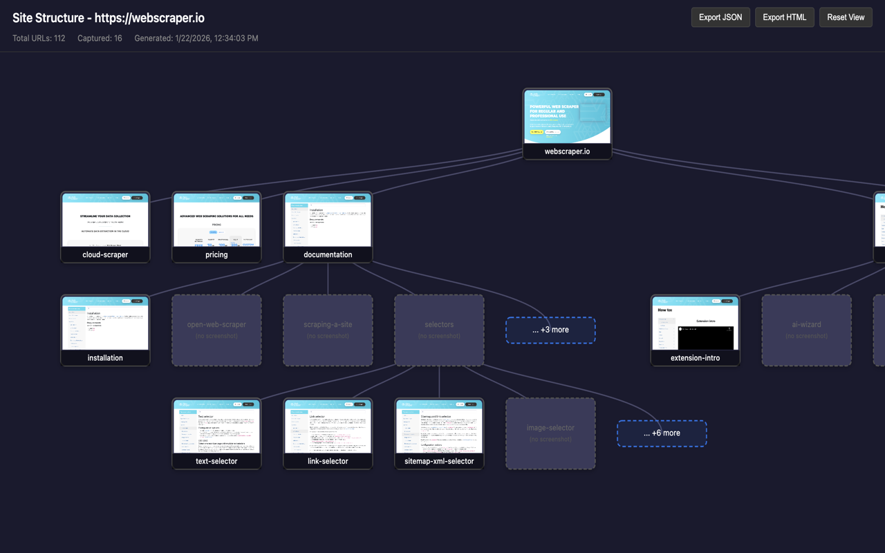

# Sitemap Visualizer

A Chrome extension that analyzes website structure with automatic sitemap discovery and interactive tree visualization.

## Features

- **Automatic Sitemap Discovery** - Fetches and parses `sitemap.xml` automatically
- **Smart Page Selection** - Breadth-first traversal to capture representative pages
- **Silent Screenshot Capture** - Background capture without interrupting your browsing
- **Interactive Tree** - D3.js-powered visualization with collapsible nodes and zoom/pan

## Installation

### From Chrome Web Store
[**Install from Chrome Web Store**](https://chromewebstore.google.com/detail/ppkjofgmbgdpklbpmiligcabmmopdnml)

### Manual Installation
1. Download or clone this repository
2. Open `chrome://extensions/`
3. Enable "Developer mode"
4. Click "Load unpacked" and select this folder

## Usage

1. Navigate to any website
2. Click the extension icon
3. Click "Analyze Current Page"
4. Explore the interactive visualization

### Settings
- **Max pages**: 10-50 pages to capture
- **Load timeout**: 3-15 seconds per page
- **Capture delay**: 0.5-3 seconds before screenshot

### Tree Interaction
- Click node → View full screenshot
- Click placeholder → Capture on-demand
- Click "+N more" → Expand hidden children
- Mouse wheel → Zoom in/out

## Changelog

### v0.1.0 (2026-01-22)

Initial release.

#### Core Features
- **Sitemap Fetching**: Auto-discovery of `sitemap.xml`, supports sitemap index (nested sitemaps)
- **Smart URL Selection**: Breadth-first traversal with branch coverage for representative page selection
- **Silent Screenshot Capture**: Chrome Debugger API (`chrome.debugger`) for background capture without interrupting browsing
- **Fallback Capture**: Falls back to `chrome.tabs.captureVisibleTab` if debugger fails
- **Interactive Tree Visualization**: D3.js vertical tree with collapsible nodes, zoom/pan, click-to-view screenshots

#### Popup UI
- "Analyze Current Page" one-click button
- Manual URL input with Enter key support
- Settings: max pages (10-50), load timeout (3-15s), capture delay (0.5-3s)
- Progress bar with current URL display
- Cancel button to abort running analysis
- **State recovery**: Popup reopening restores running state (progress bar, cancel button)

#### Report Page
- Full-size screenshot modal on node click
- Dynamic expansion: click placeholder nodes to capture on-demand
- "... +N more" nodes for branches with many children
- Smooth animations for tree updates

#### Links
- GitHub icon button in popup header
- Privacy Policy link in popup footer

## License

MIT
